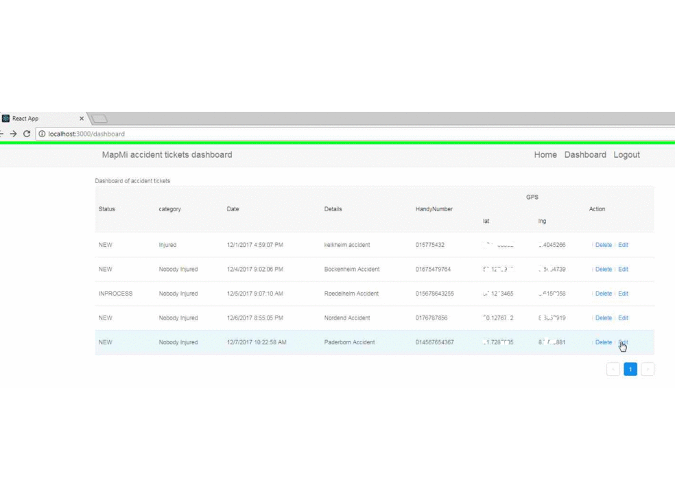

# Short Intro

it is a dashboard backend implemented by React to process the accident reported by mapmi 

mapmi is an angular implemented handy app which could report/display accidents with gps location and photos
on google map with marker

 
# install & run

- npm install

- npm start

# effects

